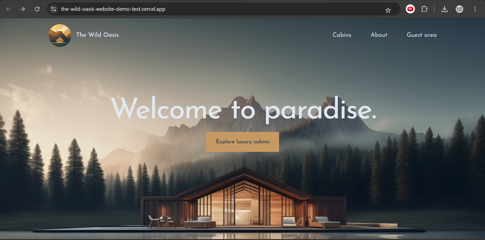
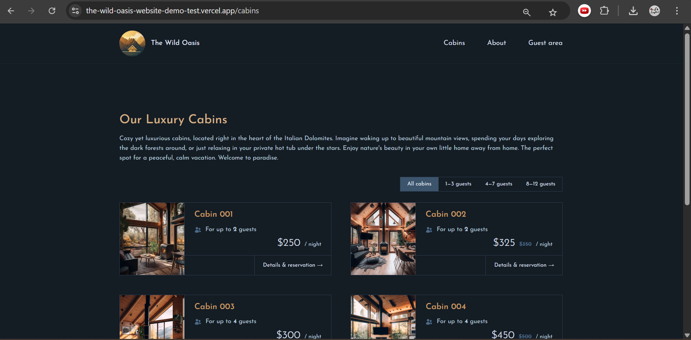
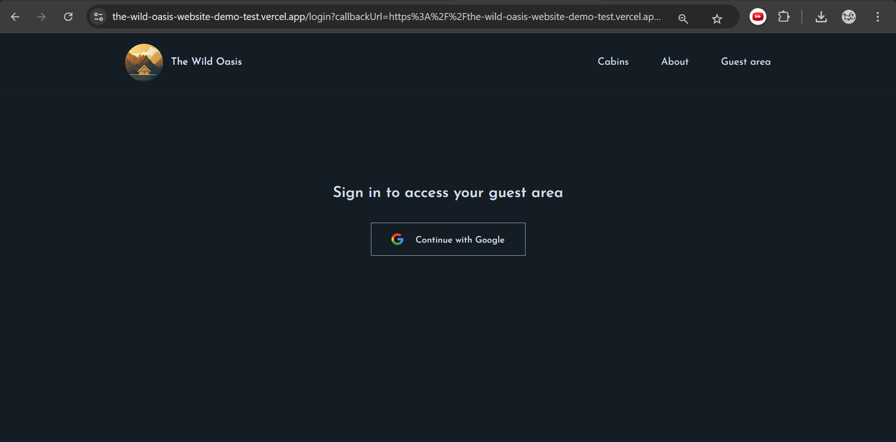
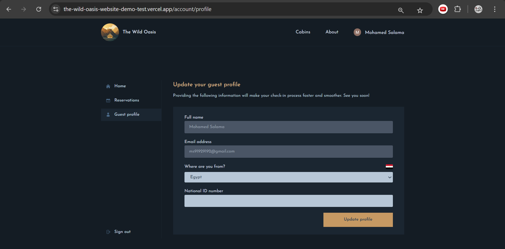
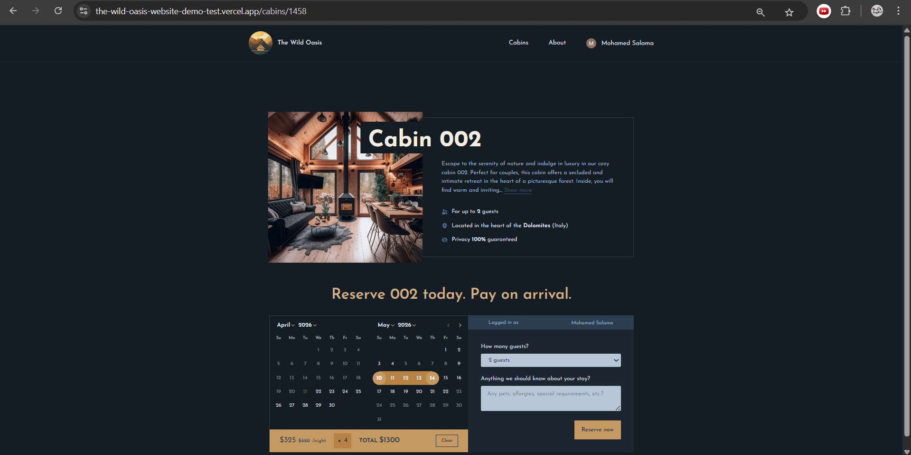
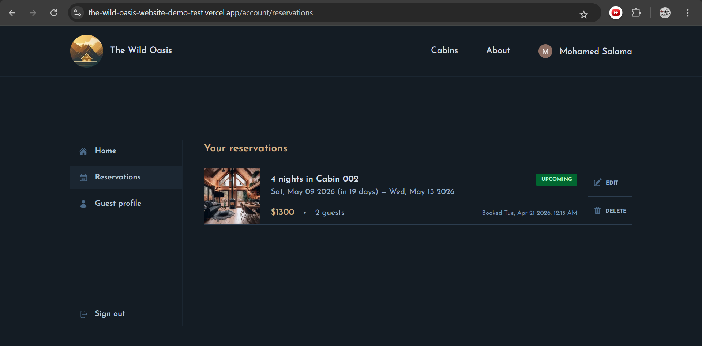
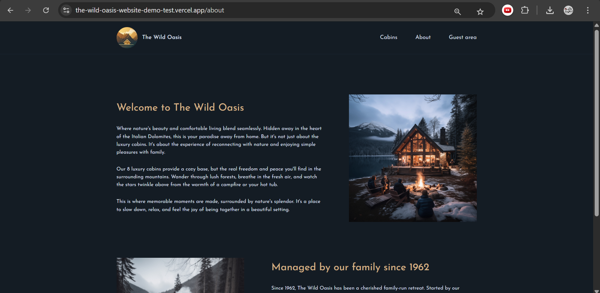

#🌴 The Wild Oasis Website

A modern hotel management web app built with Next.js for managing bookings, cabins, users, and hotel settings through a clean dashboard experience.

> ⚠️ **Desktop version only** — This application is optimized for desktop screens and is not responsive.

---

## Live Demo

https://the-wild-oasis-website-demo-test.vercel.app/

---

## 📸 Screenshots

### Dashboard




### Cabins




### Login




### Account




### Booking




### Reservations




### About



---

## ✨ Features

* Authentication flow with login and protected account access
* Dashboard with booking stats, sales data, occupancy rate, and charts
* Bookings table with filtering and sorting
* Cabins table with pricing, discount, and sorting controls
* User management
* Hotel settings management
* Dark and light mode support
* Sample data upload
* Clean desktop-first interface

---

## 🛠️ Tech Stack

This project uses Next.js 15.5.2, React 19.1.0, Supabase, NextAuth, React Day Picker, date-fns, and Heroicons. It also includes ESLint, Prettier, and Tailwind CSS 4 for code quality and styling.

---

## 🔧 Project Notes

The `/account` route is protected by middleware, and Next.js image handling is configured for cabin images stored in Supabase storage.

ESLint is configured with `next/core-web-vitals`, and the project ignores build and generated folders such as `.next`, `out`, and `build`. 

---

## 📁 Project Structure

```bash
app/
├── _components/
├── _lib/
├── _styles/
├── about/
├── account/
├── api/
├── cabins/
├── login/
├── error.jsx
├── icon.png
├── layout.jsx
├── loading.jsx
├── not-found.jsx
└── page.jsx
public/
```

---

## ⚙️ Available Scripts

```bash
npm run dev
npm run build
npm run start
npm run lint
```

These scripts come from the Next.js project setup in `package.json`. 

---

## 🚀 Getting Started

```bash
git clone https://github.com/your-username/the-wild-oasis-website.git
cd the-wild-oasis-website
npm install
npm run dev
```

---

## 📌 Notes

* Desktop version only
* Designed for a smooth hotel-management workflow
* Built as a real-world dashboard project

---

## 👨‍💻 Author

Mohamed Salama
